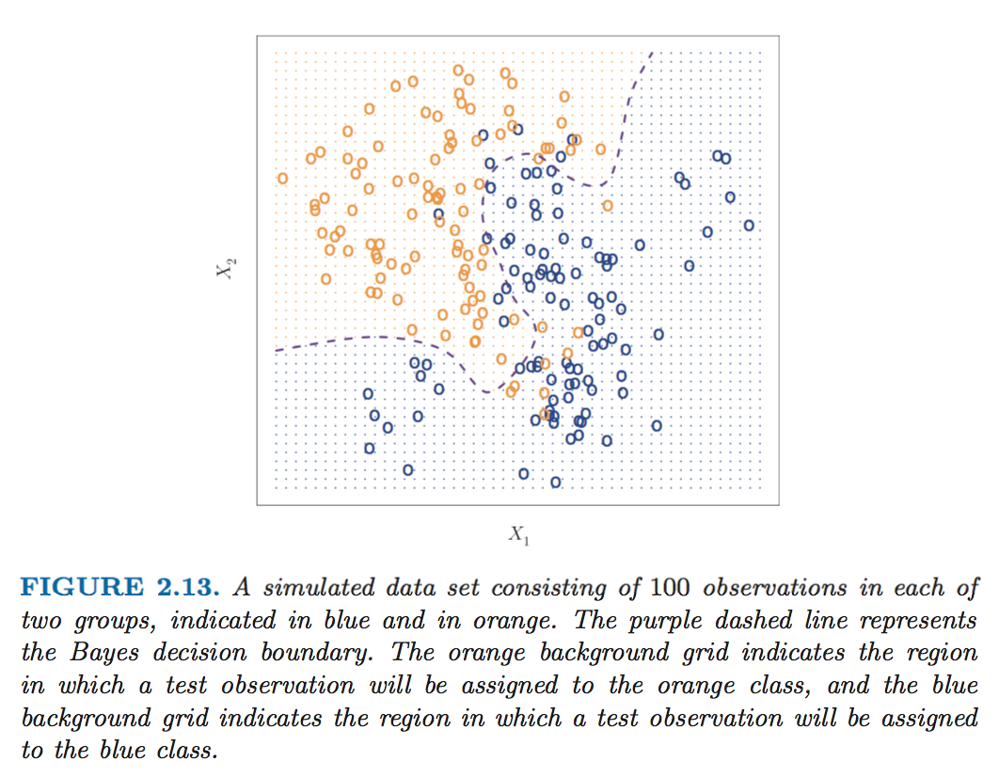

## Classification

* So far we have been using models to predict quantitative DVs (e.g., income), but we also want to predict categorical or qualitative DVs (e.g., freshman vs. sophomore vs. junior vs. senior in college).

* To do so, we can use the same methods, with some modifications (due to the fact that *y*[*i*] is no longer numerical).

#### Assessing Classification QoF

* Because *y*[*i*] is no longer numeric, we cannot use MSE.  Instead, we use **error rate**, or the proportion of mistakes that are made if we apply our estimate *f^* to the training observations.

Error Rate = (1/*n*) * (Σ{*i*=1 -> *n*}(*I*(*y*[*i*] != *y^*[*i*]))), where *I*(*y*[*i*] != *y^*[*i*]) is an indicator variable that is 1 when *y*[*i*] does not equal *y^*[*i*], and 0 otherwise.  This therefore computes the proportion of misclassifications.

* Similar rules apply as before to train vs. test vs. validation QoF.

## Bayes Classifier

#### Understanding Bayes

A prerequisite for this is understanding **Bayes Theroem**, which is not explained in the ISL book.

* A good article explanation is ["An Intuitive and Short Explanation of Bayes Theorem"](http://betterexplained.com/articles/an-intuitive-and-short-explanation-of-bayes-theorem/).

* I also liked the YouTube video, ["Bayes' Theroem - Explained Like You're Five"](https://www.youtube.com/watch?v=2Df1sDAyRvQ).

#### The Actual Bayes Classifier

* Recall that we're trying to find a classification model that minimizes the error rate.

* The error rate is minimized if every classification for each observation is the class that observation is most likely to be.  This sounds obvious.  This is called **Bayes classification**, after **Bayesian statstics**.

* With two classes, the classification is class one if P(*Y* = 1 | *X* = *x*[0]) > 0.5, and class two otherwise.  Note that P(*Y* = 1 | *X* = *x*[0]) refers to the probability that *Y* is 1 given that *X* = *x*[0].

* This also can be used to derive the **Bayes classification boundary** between two classes, or the line at which the rate is precisely 0.5.

* The Bayes classifier produces the lowest possible error rate, called the **Bayes error rate**.  Since the Bayes classifier always chooses the class for which P(*Y* = j | *X* = *x*[0]) is the largest, the error rate at *X* = *x*[0] will be 1 - max{j}(P(*Y* = j | *X* = *x*[0])).

* This means the overall Bayes errror rate will be 1 - max{j}(P(*Y* = j | *X*)), where *X* is the set of all possible *x* (*x*[0] .. *x*[*n*]).

#### Understanding by Example

What Bayes-based classification represents is how the probability of classification changes based on evidence you learn about the observation.

For example, let's imagine that we are considering politicians as "Democrat" or "Republican" based on their voting record.

Now let's say we learn that a particular politician is interested in cutting taxes.  Are they more likely to be a "Democrat" (coded as a 0) or a "Republican" (coded as a 1) based on this information?

Well we can look at our data, and we see that we have twenty politicians with statements about cutting taxes, and eight of them were "Republican".  What does this mean for the probability?

We now turn to the equation P(Y = 1 | *X* = *x*[0]).  Here, P(Y = 1) represents the probability that the politician is Republican.  (Why are Republicans considered 1?  Just our arbitrary choice of assigning categories to numbers.  It works as long as we're consistent.)

The *X* = *x*[0] part is the evidence that the politician's stance on cutting taxes (represented by *X*, the set of all possible values of this variable) is favorable (*x*[0], the particular value of this variable).

So P(Y = 1 | *X* = *x*[0]) represents the probability the politician is Republican given their stance on cutting taxes is favorable.

Since 8/10 politicians who's stances on cutting taxes is favorable are Republicans, P(Y = 1 | *X* = *x*[0]) = 8/10 = 0.8.

But what does 1 - max{j}(P(*Y* = j | *X*)) mean?

max{j}(P(*Y* = j | *X*)), mathematically, means we're looking for the value of j such that P(*Y* = j | *X*) is the largest.

Let's say we have three possible stances on cutting taxes -- they're either in favor, neutral, or against.  Also, let's say 8/10 politicians in favor of cutting taxes are Republicans, 4/10 politicians neutral on cutting taxes are Republicans, and 1/10 politicians against cutting taxes are Republicans.  Here, there are two possible values of j -- j = 1, which means Republican, and j = 0, which means Democrat.  We also have one piece of evidence to consider -- that the politician is in favor of cutting taxes.

Thus given our evidence *X* (the politician is in favor of cutting taxes), the j which maximizes P(*Y* = j | *X*) is j = 1 (Republican), because Republicans are more likely than Democrats (8/10 vs. 2/10) to be in favor of cutting taxes in our data.

max{j}(P(*Y* = j | *X*)) is the value at the maximum j.  Since the maximum j is 1, max{j}(P(*Y* = j | *X*)) = P(*Y* = 1 | *X*) = 0.8.

The Bayes error rate is 1 - max{j}(P(*Y* = j | *X*)) = 1 - 0.8 = 0.2.
