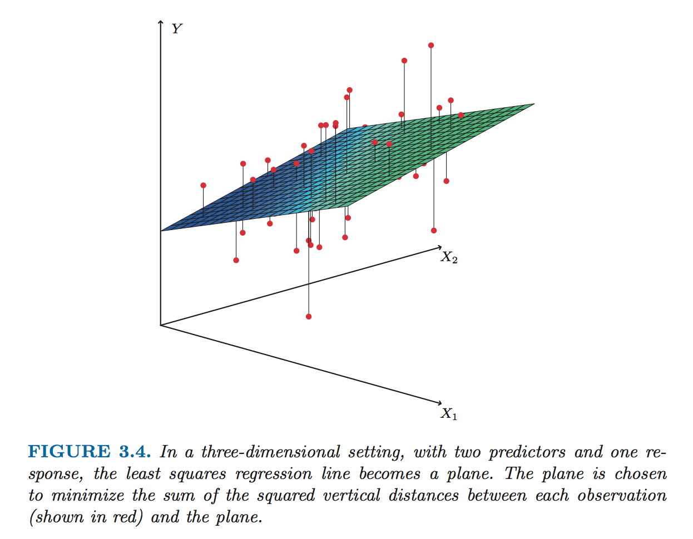

## Multiple Regression

* Many times we have more than one variable we want to use to predict.
* We can't simply construct multiple single regressions for each variable because each regression ignores all other variables, which is a bad assumption when the variables are correlated (which they often are).
* Instead, we can extend Y ~= β[0] + β[1]*X to Y ~= β[0] + β[1]X[1] + β[2]X[2] + ... + β[*p*]X[*p*] and we will now estimate β for all *p* variables rather than just β[0] and β[1].
* We still will minimize RSS.  Instead of RSS = Σ{*i*=1 -> *n*}((*y*[*i*] - *y*^[*i*])^2), RSS = Σ{*i*=1 -> *n*}((*y*[*i*] - β[0] - β[1]X[*i*,1] - β[2]X[*i*,2] - ... - β[1]X[*i*,*p*])^2).

## Key Questions for Multiple Regression Analysis

* Is at least one of the predictors X[1], X[2], ..., X[*p*] useful in predicting the response?
* Do all of the predictors help to explain Y, or are just a subset of the predictors useful?
* How well does the model fit the data?
* Given a set of predictor values, what response values should we predict and how accurate is our prediction?

## Multiple Regression Hypothesis Testing

* Instead of the null hypothesis being β[1] = 0, the null hypothesis for multiple regression is β[1] = β[2] = β[3] = ... = β[*p*] = 0.  The alternative hypothesis for multiple regression is that at least one β is not 0.
* This hypothesis is performed by comuting the **F-statistic** which is F = ((TSS - RSS)/*p*)/(RSS/(*n* - *p* - 1)).
* If the null hypothesis is true, F will be close to 1.  If the null hypothesis is false, F will be (much) greater than 1.
* The F-statistic will be drawn from an **F-distribution** from which we can draw a p-value (just like with the t-test earlier) that can be used to determine if we should reject the null hypothesis.
* The t-statistic shows the explanatory power of a given predictor, whereas the F-statistic shows the explanatory power of the overall model across all predictors.
* The t-statistic for a given variable is equivalent to the differences in F-statistics between when that variable is included and when it is not.
* It is quite important to look at the F-statistic even if individual t-statistics are large, since with a large quantity of variables the chance of an individual t-statistic being large by chance adds up.  For 100 variables, 5 of them should have a p-value < 0.05 purely by chance.  This is called a **false discovery**.

## Multiple R^2

* In multiple regression, R^2 no longer equals *r*^2, or Corr(X,Y)^2.  However, it does equal Corr(Y,Y^)^2
* One downside of R^2 is that adding another variable to the model, no matter how superfluous, will always increase R^2.
